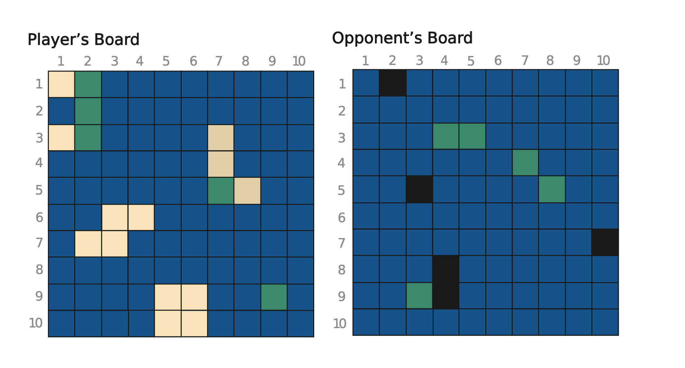

# IslandsEngine

Source code from **Functional Web Development with Elixir OTP and Phoenix** book. 

## Introduction

Stateful applications can maintain temporary connection with the clients and actions in real-time, although it's not scalable as require too much resources to handle with the number of connections as it grows. 
Stateless solves this, but adds some trade-offs. Now the server don't keep the connection, it just response based on the inputs. However the latency is greater because we need more round-trips to database. The database become the bottleneck and we start to _design_ the application to optimize the tables itself, and not thinking what the application needs.

### The game of islands

If the web is complex, web games take it to the extreme. The _island game_ is a game where a player creates some islands on a board, and the opponent tries to find these islands by making guesses. If the opponent discovers all the island locations, he wins the game.

## Part 1 - Define the Functional Core in Elixir

### Model Data and Behavior

At the beginning, we won't use any web framework (Phoenix) or ORM (Ecto). This will be important to focus on the core of the project and not be distract with the framework itself.

Picture of the game

Of the left side is own board. The _sand_ coordinates are where we place the island, if the opponent guess one of the coordinates, the coo will be turn green. 
On the right side, is the board of the opponent, the back coo is where the opponent missed the shot, and the green ones are the right guesses. 

